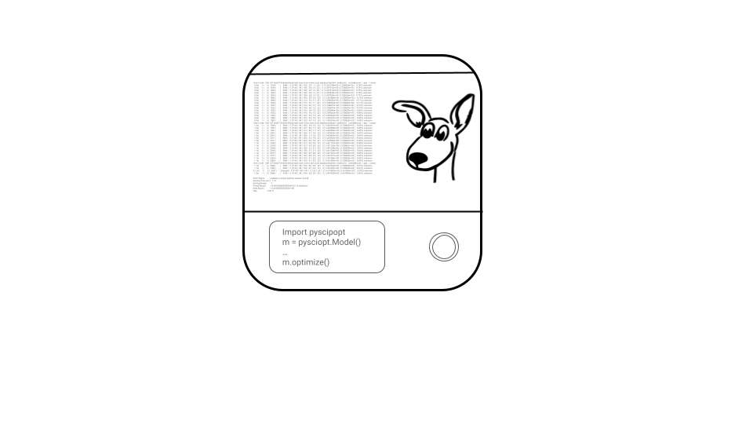

# SCIPdex  



A collection of interactive exercises to get you started (and more) with [PySCIPOpt](https://github.com/scipopt/PySCIPOpt).
It is designed to be used along with the [PySCIPOpt documentation](https://scipopt.github.io/PySCIPOpt/docs/html/index.html).  
The exercises are split into folders by topic. Each folder contains a README.md file describing the exercises and python files with TODOs. Each folder has a `check.py` file that checks if the exercises are correctly solved.

## Installation
The exercises depend only on PySCIPOpt and its dependencies. You can install them with:
```bash
pip install pyscipopt
```
for other installation options, please refer to the [PySCIPOpt documentation](https://pyscipopt.readthedocs.io/en/latest/install.html).

Now you're ready to start the exercises! 🚀 Start by going to [00_intro](00_intro) and follow the instructions in the [README.md](00_intro/README.md) file.

## Contributing
If you find any issues or have suggestions for improvements, please open an [issue](https://github.com/mmghannam/scipdex/issues/new/choose) or a pull request. Thank you!
