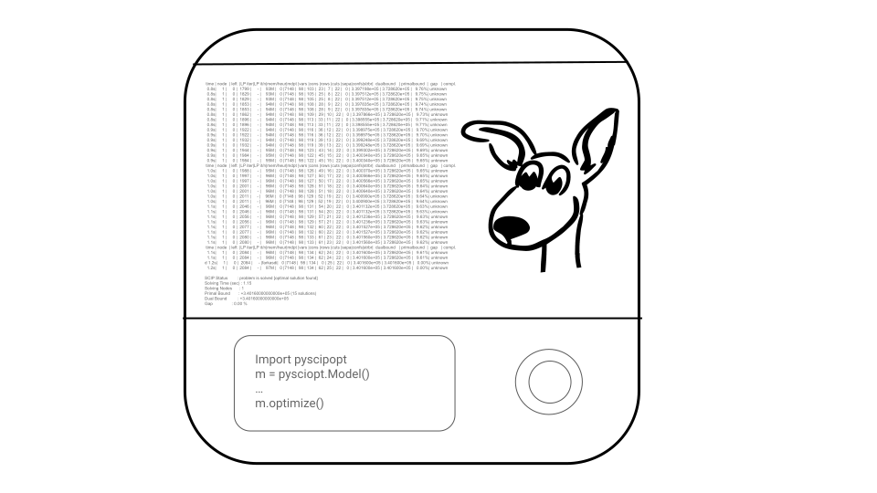

# SCIPDex

> Currently still WIP, feedback and contributions are very welcome!



A collection of interactive exercises to get you started (and more) with [PySCIPOpt](https://github.com/scipopt/PySCIPOpt).
It is designed to be used along with the [PySCIPOpt documentation](https://scipopt.github.io/PySCIPOpt/docs/html/index.html).

The exercises are split into folders by topic. Each folder contains a README.md file describing the exercises and python files with TODOs. Each folder has test files that checks if the exercises are correctly solved.

## Installation
The exercises depend only on PySCIPOpt (and its dependencies) and pytest. You can install them with:
```bash
pip install -r requirements.txt
```
For other ways of installing PySCIPOPt, please refer to the [PySCIPOpt documentation](https://pyscipopt.readthedocs.io/en/latest/install.html).

## Getting Started

Now you're ready to start the exercises 🚀 The repository is divided into chapters, each containing multiple problems. In each chapter there is a README describing each of the problems, and in each of the problems there is a README describing the problem in detail and the exercises to be completed. Besides this README, the problem folder also has a `[problem].py` file to solve the exercises and a `test_[problem].py` file for testing your solution. More complex problems might need more files to structure the code better, but the corresponding README's explain the structure. Here is a brief description of each chapter:

- intro: An introduction to PySCIPOpt and its more elementary functionalities.
- modeling: 
- event_handler: Unlocking the ability to interrupt the solving process when a predetermined event is caught, and executing user-code.
- primal_heuristic
- separator
- branching_rule
- branch_and_price

We recommend starting by going to [intro](intro) and following the instructions in the [README.md](intro/README.md) file.

## Checking your solutions
Each exercise set has a bunch of test files, which you can run by
```bash
pytest EXCERCISE_FOLDER
```

for instance, to run all tests in the modeling chapter, you can run
```bash
pytest modeling
```
You can also run specific test files, for example, to run the tests for the knapsack problem set in the modeling
chapter, you can run
```bash
pytest modeling/knapsack/test_knapsack.py
```

## Contributing
If you find any issues or have suggestions for improvements, please open an [issue](https://github.com/mmghannam/scipdex/issues/new/choose) or a pull request. Thank you!
