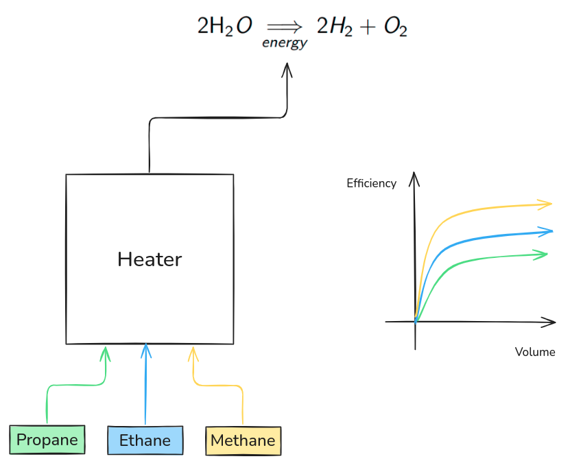

## Hydrolysis problem

Mathematical programming is prevalent in the chemical industry. In this exercise we will give a simplified version of how it can be useful. 

### Exercise 1: Simple problem

Consider a simple chemical process: $\,\, 2H_{2}O \xrightarrow{} \; 2 H_{2} + O_{2}$.

The objective is to produce as much hydrogen as possible with the following restrictions:

- Given budget
- Need to buy $H_{2}O$
- Limit on how much $H_{2}O$ our supplier will sell
- Cost per reaction
- Cost of buying $H_{2}O$

**Your task** Construct a mathematical program for this problem.
    
### Exercise 2: 

Let us now complicate the previous example. Now, we also need to provide the energy for the reaction, by burning gases in a heater. 
The heater can only burn one gas at a time, and the gases have different efficiencies and costs.

The additional constraints are

- Supply our own heat
- Heater cannot mix gases
- Each gas has different cost, efficiency, and supply 

Here is a diagram representing the problem.

The efficiency of the gases is given as a multiplier to their efficiency, representing diminishing returns. If $y_{\text{gas 1}}$ is the variable representing the amount of gas 1 burned, then $\text{efficiency}_{\text{gas 1}} \, \cdot \, y_{\text{gas 1}}$ is the energy it produces. 

**Your task:** Construct a mathematical model for this problem.

    
Hint 1

    If we add a binary variable to each of the gases stating whether we buy them or not, we can enforce the "only one gas" by saying that their sum is at most one.

